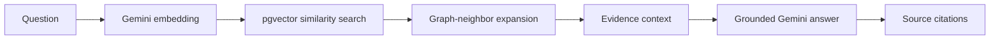

# CineGraph

A free-first movie feedback intelligence app built around a real knowledge graph and Graph RAG. It synchronizes movie metadata, classifies feedback, detects emerging issues, preserves every change, and answers questions with traceable evidence.

   

## What works

- TMDB movie search, metadata, credits, images, ratings, and user-review ingestion
- NYTimes professional review summaries and source links
- Optional OMDb ratings, awards, and box-office enrichment
- Gemini classification, sentiment, entity extraction, embeddings, and grounded answers
- Supabase/Postgres persistence with `pgvector`
- Interactive knowledge graph connecting movies, people, sources, and categories
- Hybrid Graph RAG: semantic retrieval → graph expansion → cited synthesis
- Trending-category detection and sentiment movement
- Add, edit, soft-delete, and restore feedback
- Append-only versions and audit events generated in the database
- Daily Vercel Cron synchronization
- Live-only data path with no synthetic movie or review fallback

## Run locally now

Requires Node.js 22+.

```bash
npm install
npm run dev
```

Open [http://localhost:3000](http://localhost:3000). The app loads the configured default movie from TMDB/Supabase.

Run the production checks:

```bash
npm run typecheck
npm run build
npm start
```

## Enable the live pipeline

### 1. Create the free API keys

- [TMDB developer API](https://developer.themoviedb.org/docs/getting-started)
- [NYTimes Developer APIs](https://developer.nytimes.com/get-started)
- [Google AI Studio / Gemini](https://aistudio.google.com/app/apikey)
- [Supabase](https://supabase.com/dashboard)
- Optional: [OMDb](https://www.omdbapi.com/apikey.aspx)

TMDB is the canonical movie and audience-review source. NYTimes adds matching professional-review summaries and links. OMDb only enriches aggregate ratings, so the app does not require it.

### 2. Create the Supabase schema

Create a Supabase project, open **SQL Editor**, paste the complete contents of:

```text
supabase/migrations/001_cinegraph.sql
```

Run it once. It installs `vector`, creates the relational graph, audit/version triggers, graph-maintenance trigger, indexes, and the semantic-match function. Row Level Security is enabled with no browser policies because this app accesses Supabase only from server routes using the service role.

### 3. Configure environment variables

```bash
cp .env.example .env.local
```

Fill these values:

```dotenv
TMDB_API_READ_TOKEN=...
NYT_API_KEY=...
GEMINI_API_KEY=...
SUPABASE_URL=https://YOUR_PROJECT.supabase.co
SUPABASE_SERVICE_ROLE_KEY=...
APP_ADMIN_KEY=choose-a-long-random-string
CRON_SECRET=choose-a-different-long-random-string
```

Optional:

```dotenv
OMDB_API_KEY=...
GEMINI_MODEL=gemini-2.5-flash
```

Never prefix secrets with `NEXT_PUBLIC_`. After setting `APP_ADMIN_KEY`, open the app’s **Connections** dialog and enter the same value. It is kept in `sessionStorage` for that browser tab—not in the repository or local storage.

### 4. Bootstrap a live movie

Start the app, choose **Change movie**, search for a title, and select it. CineGraph will:

1. Fetch TMDB metadata, credits, keywords, external IDs, and up to eight user reviews.
2. Add optional OMDb ratings.
3. Retrieve matching NYTimes Article Search review summaries.
4. Classify and embed each review with Gemini.
5. Upsert the movie and feedback into Supabase.
6. Generate graph nodes, edges, versions, and audit records.

## Deploy to Vercel

1. Push this folder to GitHub.
2. Import the repository at [vercel.com/new](https://vercel.com/new).
3. Keep the detected framework as **Next.js**.
4. Add the same environment variables from `.env.local`.
5. Deploy.

`vercel.json` schedules `/api/cron/sync` every day at 08:00 UTC. This schedule fits Vercel Hobby’s daily cron cadence. Vercel sends `CRON_SECRET` as a bearer token when that variable is configured.

### Fastest first deployment

Configure the environment variables before deployment; the production app never substitutes synthetic data.

## Graph RAG: what is actually happening



This is not a decorative graph pasted beside ordinary RAG:

- Each feedback record has a 768-dimensional embedding.
- `match_feedback` selects semantically relevant active feedback.
- The feedback’s category and entity links determine the traversal path.
- The synthesis prompt receives only retrieved records and their IDs.
- The answer must cite those IDs; the UI exposes each source excerpt and URL.
- Without Gemini, the same workflow falls back to deterministic lexical retrieval and an extractive cited answer.

## Knowledge graph model

The graph is stored in ordinary Postgres so the free Supabase tier is enough:

```text
Movie ──stars──────────▶ Person
Movie ──praised for────▶ Category
Movie ──criticized for─▶ Category
Source ──reviewed──────▶ Movie
Source ──mentions──────▶ Person / Concept
Edge ──supported by────▶ Feedback
```

The source-of-truth tables are `entities` and `graph_edges`. Each evidence-derived edge keeps its `feedback_id`, confidence, evidence phrase, and validity fields. A database trigger rebuilds those edges whenever feedback is inserted, edited, deleted, or restored.

## Audit guarantees

- Feedback is soft-deleted, never silently destroyed through the UI.
- Every insert/update/delete/restore writes a complete JSON snapshot to `feedback_versions`.
- Every mutation writes an event to `audit_events`.
- Deleted feedback is excluded from trends, graph retrieval, and answers.
- Restoring it creates another version and reintroduces its graph facts.
- Source payloads are retained separately in `raw_source` / `raw_sources`.

## API routes

| Route | Method | Purpose |
|---|---:|---|
| `/api/status` | GET | Safe integration health—never returns secrets |
| `/api/snapshot` | GET | Complete dashboard snapshot |
| `/api/movies/search?q=` | GET | TMDB movie search |
| `/api/sync` | POST | Synchronize one TMDB movie |
| `/api/feedback` | POST | Classify and create feedback |
| `/api/feedback/:id` | PATCH | Create an edited version |
| `/api/feedback/:id` | DELETE | Soft-delete feedback |
| `/api/feedback/:id` | POST | Restore feedback |
| `/api/rag` | POST | Run hybrid Graph RAG |
| `/api/cron/sync` | GET | Update tracked movies from Vercel Cron |

Write and AI routes require `x-admin-key` only when `APP_ADMIN_KEY` is configured. Set it before exposing a live deployment to avoid somebody consuming your free Gemini quota.

## Free-tier reality

- The configured integrations all offer free tiers suitable for this project.
- TMDB is free for noncommercial use with required attribution.
- NYTimes offers developer API access with rate limits.
- Gemini has a limited free tier; free-tier content may be used by Google to improve its products.
- Supabase’s free project is enough for an MVP and small portfolio demo.
- Vercel Hobby can host the app and daily cron.

“Continuous” here means scheduled synchronization plus immediate processing of user-added feedback. Polling every minute would burn free quotas without adding value to this project.

## Project structure

```text
app/                       UI and server API routes
components/                Dashboard, chart, graph, UI primitives
lib/analytics.ts           Trends, heuristic classifier, graph projection
lib/server/providers.ts    TMDB, NYTimes, OMDb adapters
lib/server/gemini.ts       Classification, embeddings, answer synthesis
lib/server/repository.ts   Supabase persistence boundary
lib/server/rag.ts          Hybrid retrieval and graph traversal
lib/server/sync.ts         Idempotent ingestion pipeline
supabase/migrations/       Complete database setup
vercel.json                Vercel framework and cron configuration
```

## Data-source notes

TMDB supplies the main audience-review stream. NYTimes returns matching professional-review metadata, summaries, and article links—not full copyrighted articles. Movies with no provider reviews can still use the built-in feedback form/import source. Additional sources can implement the same normalized `Feedback` shape without changing Graph RAG.

## License

MIT. Data returned by external providers remains subject to each provider’s terms and attribution requirements.
