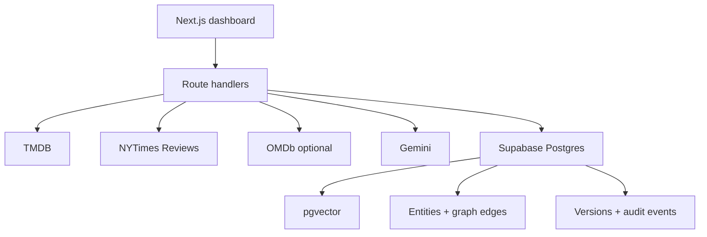

# CineGraph architecture

## Runtime

The browser talks only to Next.js route handlers. Provider and service-role keys never enter the client bundle. Route handlers normalize all sources into a shared feedback model and use Supabase’s REST interface, which keeps deployment serverless and Vercel-compatible.

## Ingestion transaction shape

1. Fetch the canonical movie record from TMDB.
2. Use its IMDb ID for optional OMDb enrichment.
3. Search NYTimes with the canonical title and reject non-exact normalized title matches.
4. Classify and embed normalized feedback.
5. Upsert external records by `(source_key, external_id)`.
6. Database triggers version each mutation and rebuild evidence-derived graph edges.
7. Dashboard analytics are calculated from active records so deletes/restores are reflected immediately.

## Retrieval path

1. Embed the question using `gemini-embedding-001` at 768 dimensions.
2. Call `match_feedback` for cosine similarity over active feedback for one movie.
3. Expand context through categories and mentioned entities attached to those records.
4. Give Gemini only the retrieved evidence, stable feedback IDs, and traversal path.
5. Return answer text, source excerpts, source URLs, and the graph path.
6. Use lexical retrieval plus extractive synthesis whenever Gemini/vector retrieval is unavailable.

## Security boundary

- Supabase service-role credentials exist only on the server.
- RLS is enabled and no direct browser access policy is installed.
- `APP_ADMIN_KEY` optionally gates sync, mutation, and AI routes.
- `CRON_SECRET` independently protects scheduled sync.
- Inputs are length-limited before provider calls or database writes.
- Review pages are linked, not scraped or reproduced.

## Extension point

Add a provider adapter that returns the normalized feedback fields: stable external ID, author, body/summary, canonical URL, occurrence timestamp, source-update timestamp, and raw source object. The classification and graph pipeline does not need to change.
